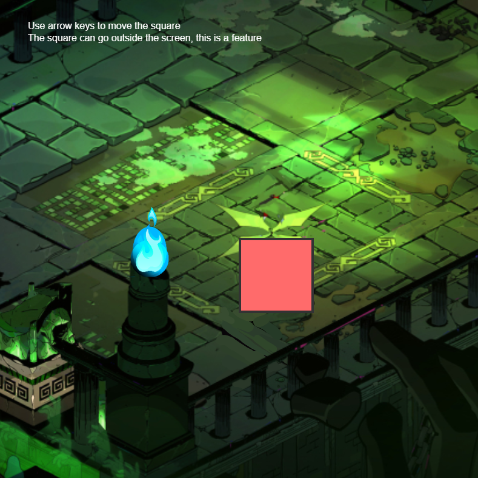

# How to Run

Install dependencies:

```
npm i
```

Start development mode:

```
npm run dev
```

## Dev Notes

There are many features I want to implement, but I haven't had enough time to complete them yet.

Planned but not yet implemented features include:

* WebGL rendering
* Asset loading system (e.g., load all scene assets before displaying the scene)
* Tween system (timeline, built-in easing functions)
* Texture atlas support
* Development and build workflow
